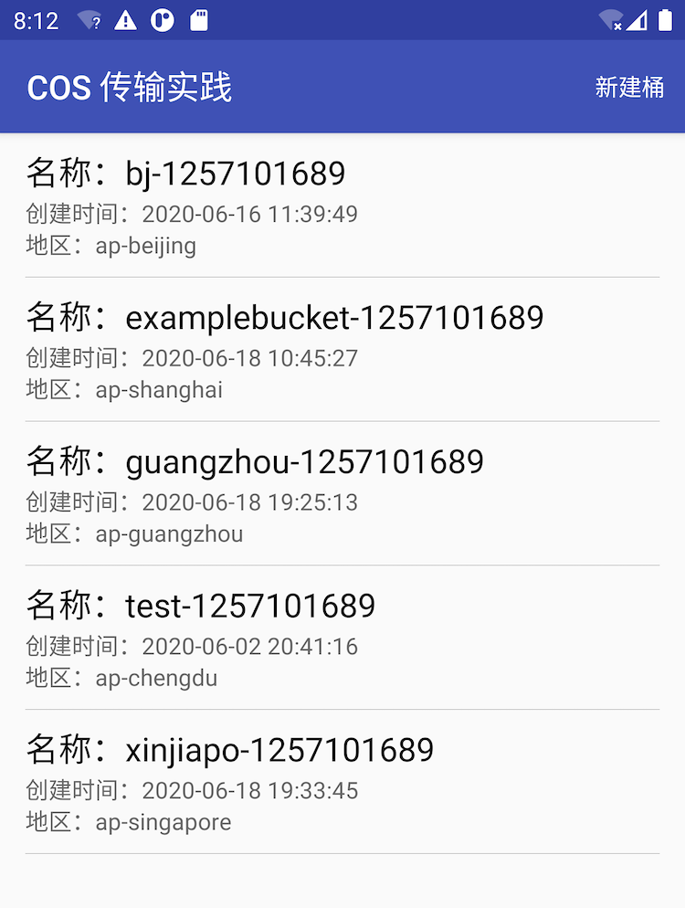
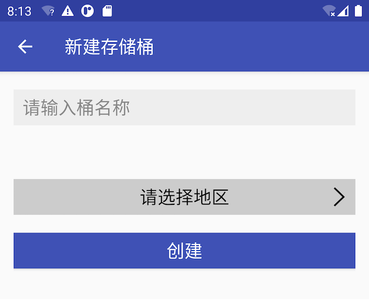
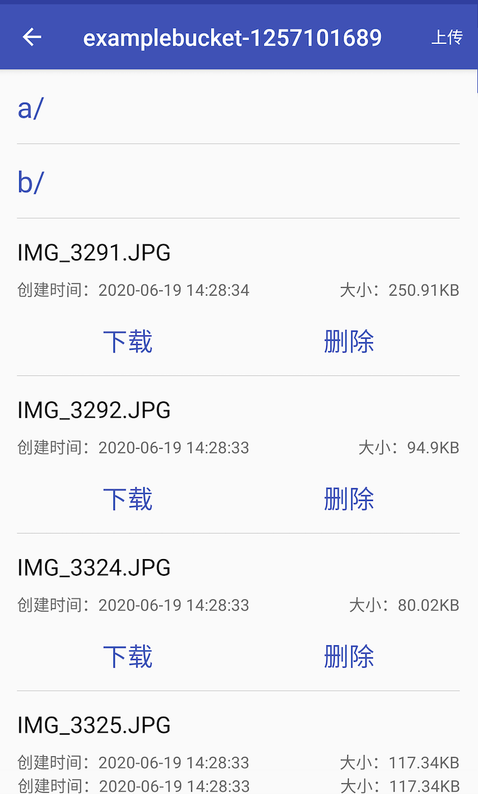
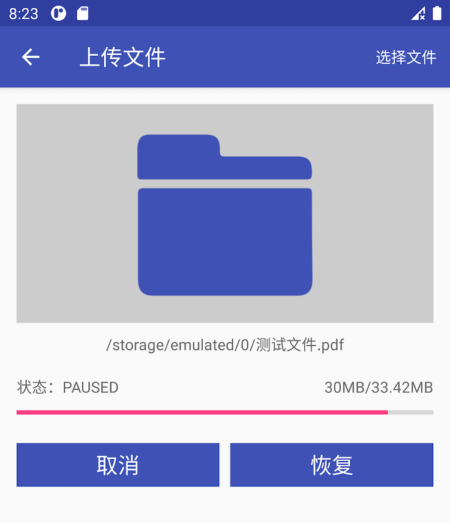
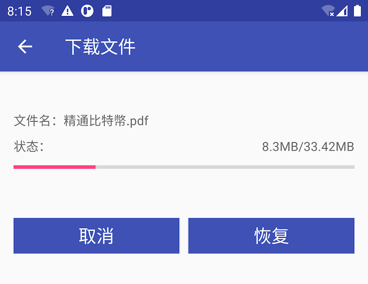

# COSTranferPractice

## 简介

 腾讯云 COS XML 体验 demo，您可以参考 快速体验 来体验 COS 传输实践 demo。

## 准备
- Android系统版本：4.4 及以上。
- 腾讯云 APPID、SecretId、SecretKey

## 运行

1. clone项目，用IDE打开

2. 按照 StsNodejsDemo 的 README.md 配置并启动本地临时秘钥服务

3. 修改app项目MySessionCredentialProvider中的临时秘钥url为2步骤中本机的临时秘钥服务url

3. 运行app项目，体验COS传输实践demo

## 注意
- 本项目也可以采用ShortTimeCredentialProvider运行，不过仅仅是为了演示，正式环境中不要采用此方式。
应该采用默认的[通过临时秘钥进行授权](https://cloud.tencent.com/document/product/436/12159#.E5.88.9D.E5.A7.8B.E5.8C.96.E6.9C.8D.E5.8A.A1)。
- ShortTimeCredentialProvider方式，通过在环境变量中配置您的Q_COS_APP_ID、Q_COS_SECRET_ID、Q_COS_SECRET_KEY，注意SecretId、SecretKey明文不要暴露到不安全环境下
- 环境变量更改后Android Studio可能需要重启 相关配置才会更新

## 功能
#### 1.存储桶列表
启动示例APP后将展示用户已创建的所有存储桶，如下图所示：

#### 2.添加存储桶
点击右上角【新建桶】，在配置页面输入桶名称并选择存储桶的所属[地域](https://cloud.tencent.com/document/product/436/6224)，如下图所示：

#### 3.对象列表
选择某个存储桶，将看到该存储桶内所有文件以及文件夹，如下图所示：

#### 4.上传文件
在文件列表页面点击右上角的【上传】，然后选择文件进行上传，如下图所示：

#### 5.下载文件
点击对象列表中文件下方的【下载】按钮，进行文件下载，如下图所示：

## 相关文档

* COS XML SDK：https://cloud.tencent.com/document/product/436/12159
